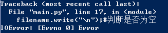

# W1：极简交互式笔记系统

* 
 之前加班拖延太重，这周开始争取跟上大部队。
*  
第一周任务根据芝麻星中的卡片提示，参考笨办法13题~17题

## **本周整体任务概述:**

* 
完成一个极简交互式笔记系统,需求如下:

  * 
一次接收输入一行笔记

  * 
保存为本地文件

  * 
再次运行系统时,能打印出过往的所有笔记

* 
发布: 发布到各自仓库的 _src/om2py0w/0wex1/ 目录中
* 
指标:
包含软件使用说明书: README.md，能令其它学员根据说明书,运行系统,完成所有功能

**环境**

* 系统：Win10

**开发过程
**
* 
调用脚本 main.py，待在PowerShell中运行之

* 
建立同名txt文档：main.txt，存放于同一文件夹

 使输出文件保存在本地文件内

* 
解包(unpack)参数script，name=argv #script=main.py, name=main.txt

    from sys import argv
    script, name = argv
    
* 文件打开
     filename = open(name,"r+")

* 
读取文件

  笨办法习题15：
  
  > 使用argv和raw_input来从用户获取文件

      filename = open(name,"r+")#打开文件
      print filename.read();#打印之前的内容
      line = raw_input("中文?")#获取输入的内容并保存到line

* 写入文件

      filename.write(line);#写入文件
    
    * 出现错误：未写入之前内容
    
    
    
  * 加入代码，解决

          filename.write(filename.read());

* 文件关闭（随即检查是否自动保存）

      filename.close()

* 输出内容前有空格

  看其他同学教程，在@hysic's python journey中收获解决方法
  
      import os
      if os.stat(name).st_size != 0:
  
* 代码

      # _*_ coding:gbk _*_

      from sys import argv
      import os

      script, name = argv

      filename = open(name,"r+")#打开文件

      print filename.read();#打印之前的内容
    
      line = raw_input("中文?")#获取输入的内容并保存到line

      filename.write(filename.read());#写入之前的

      if os.stat(name).st_size != 0:
      filename.write("\n");#判断是否为空
    
      filename.write(line);#写入新输入的

      filename.close()#保存并关闭文件